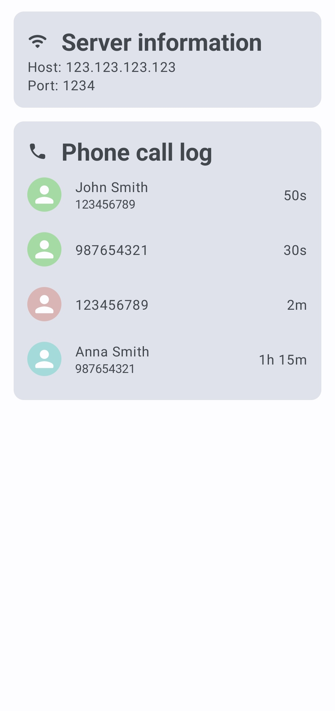

# CallMonitor

## Description

**CallMonitor** is an Android application that monitors incoming and outgoing calls and stores the
details in phone call log in the background. At launch it also starts a REST API server that
can be used to view the call log, current call status and server status. Beside of that the
application provides a simple user interface to view the call log and the server configuration.

More detailed information about the application can be
found [here](https://swistak7171.github.io/CallMonitor/index.html).

## Architecture

The project uses **Clean Architecture** and **Model-View-Intent (MVI)** architectural patterns to
design and structure the application. Clean Architecture provides a clear separation of concerns,
dividing the codebase into distinct layers (UI, Presentation, Domain, Data and Data Source) ensuring
scalability and maintainability. The MVI pattern enhances the user interface by emphasizing a
unidirectional data flow and enabling a reactive approach to handle UI updates.

## Supported Android versions

The application is compatible with Android 6.0 (API level 23) and higher.

## Screenshots

    

        
        
    

    

        
        
    

